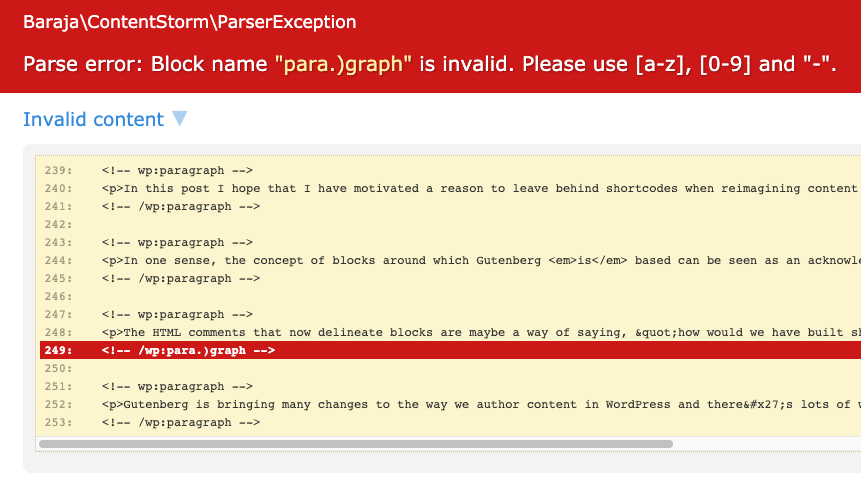

Content with module system
==========================


A simple PHP library for rendering content with components.

📦 Installation & Basic Usage
-----------------------------

To manually install the package call Composer and execute the following command:

```shell
$ composer require baraja-core/content-storm
```

🗺️ Idea
-------

Imagine article in database with content:

```text
Hello, this is article about cats.

<!-- brj:heading -->
<h3>How to breed a cat?</h3>
<!-- /brj:heading -->

<!-- brj:paragraph -->
<p>The behavior of cats is very simple. It is important to have a <b>lot of meat</b>.</p>
<!-- /brj:paragraph -->

<!-- brj:code -->
Animal
   | Mammal
      | Cat
<!-- /brj:code -->

<!-- brj:my-component {"align":"center","textColor":"#737272","customFontSize":14} -->
This content will be passed to my own component.
The parameters (stored in json) that the component uses for advanced rendering are also passed.
<!-- /brj:my-component -->
```

In the basic usage, you can write content as plain HTML. In this case, the exact same content that you create is returned.

By adding a comment annotation (for example `<!-- brj:heading -->`), you can mark a part of a template as a component.

The component consists of a **name** (opening and closing tags must be the same), **content** and optional **parameters**.

🛠️ Definition
-------------

A component is defined as a part of a text file that begins (for example `<!-- brj:heading -->`) and ends (`<!-- /brj:heading -->`) with a comment annotation.

Common syntax is:

```
<!-- brj:my-component {"align":"center","textColor":"#737272"} -->
      ^          ^                 ^
      |          |                 |
      ______    _____________    ______________
     /      \  /             \  /              \
<!-- (prefix):(component-name) (json parameters) -->
```

Important parser rules:

- Components cannot be nested.
- The name in the start and end tags must be the same.
- Parameters are written as valid json, which can be embedded. Each parameter always has a key (string) and a value (mixed).

✅ Debugging
------------

In case of an error, a `ParseException` is automatically thrown, which contains information about the **passed input** and the **line number** where the error occurred.

If your project supports Tracy, the error is drawn graphically directly in the passed text:



🌐 Compatibility
----------------

This package is fully compatible with the WordPress Post component system. This package adds many new features and benefits that you will quickly appreciate.

📄 License
-----------

`baraja-core/content-storm` is licensed under the MIT license. See the [LICENSE](https://github.com/baraja-core/content-storm/blob/master/LICENSE) file for more details.
